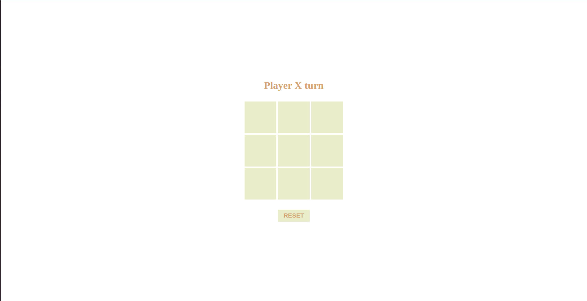

# Tic Tac Toe Project



<p align="center">
  <a href="https://joao4xz.github.io/odin_tictactoe/">Live Preview</a>
</p>

"The Odin Project" tic tac toe project.

This project has the purpose of using SASS, factory function, module pattern and private/public variables and functions.

## Building the Project

To compile the Sass files into CSS, follow these steps:

1. Make sure you have Sass installed globally on your system. If not, you can install it by following the instructions provided on the official Sass website.

2. Open your terminal or command prompt and navigate to the project directory.

3. Run the following command to compile the Sass files:

   ```shell
   sass --watch CSS/style.scss CSS/style.css
